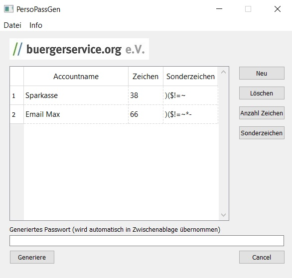

# PersoPassGen
Generates a Password from german Personalausweis-data with a leading uppercase and a specialsign.    
Platformindependent for Windows and Linux.   

Version: 0.1   
Author: buergerservice.org e.V. <KeePerso@buergerservice.org>    

-------------
requirements:
-------------
platform independent cause cmake/qt can build Linux and Windows   
AusweisApp2 (installed for all users)   
cardreader (maybe you can use a new Android Handy as cardreader - connect in AusweisApp2)   
for online identification ready Personalausweis - you can test it in AusweisApp2 with "Meine Daten einsehen"   
internetaccess   

-------------
installation:
-------------
for qt you have to deploy qt with deployprogram in the qt bin directory.   

Microsoft wrote in point 6 that its possible to copy the crt-dlls with an release-app:   
https://devblogs.microsoft.com/cppblog/introducing-the-universal-crt/

----------------------------
known problems and questions
----------------------------

is my PIN safe?  
	- you can use a cardreader with keypad or smartphone with activated PIN-input, then the program cant see the PIN.  

what data of my Personalausweis is used for the key?  
	like you can see in the source used are this data  
	FamilyNames (or BirthName if set)  
	GivenNames  
	DateOfBirth  
	PlaceOfBirth  
 

---------------
versionhistory:
---------------
0.1 start  

-----
build
-----
source was build with Visual Studio 2019   
with cmake and qt   
and our own workflowLibrary/workflowLibraryLinux   
